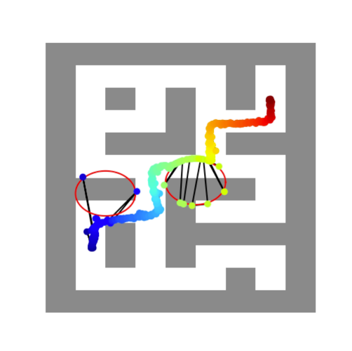
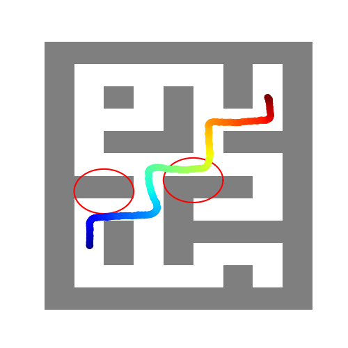

| Local trap (no CLF) | Unsafe behavior (no CLF) |
|---|---|
|  |  |

*Figure A: Qualitative results without CLF, showing a local-trap [4] case (left) and an unsafe realized trajectory case (right).* 

*[4] Xiao, W., Wang, T.-H., Gan, C., Hasani, R., Lechner, M., and Rus, D. Safediffuser: Safe planning with diffusion probabilistic models. International Conference on Learning Representations, 2025.*