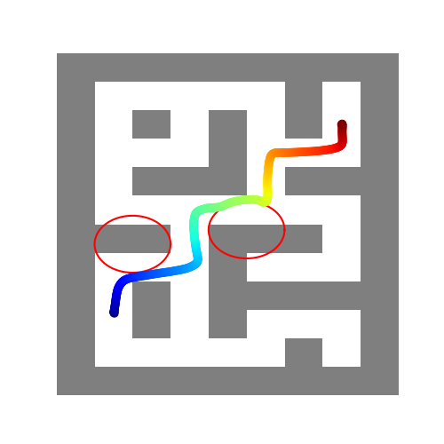
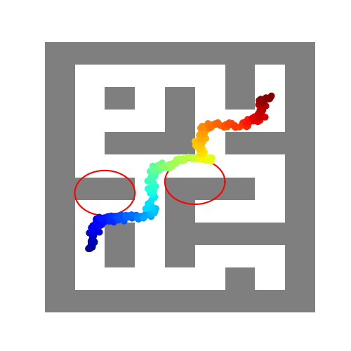
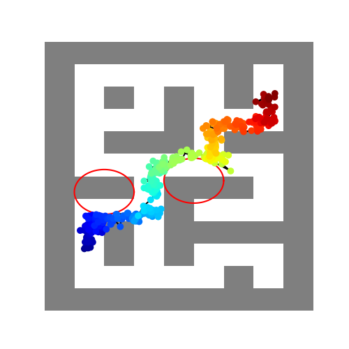
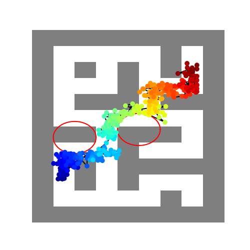
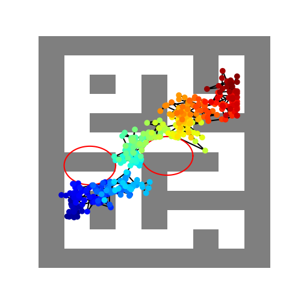

*Table C. Performance for inject noise into dynamic model.* 
| **No noise** | **$\mathcal{N}(0, 0.1)$** | **$\mathcal{N}(0, 0.2)$** | **$\mathcal{N}(0, 0.3)$** | **$\mathcal{N}(0, 0.4)$** |
|---|---|---|---|---|
|  |  |  |  |  |
